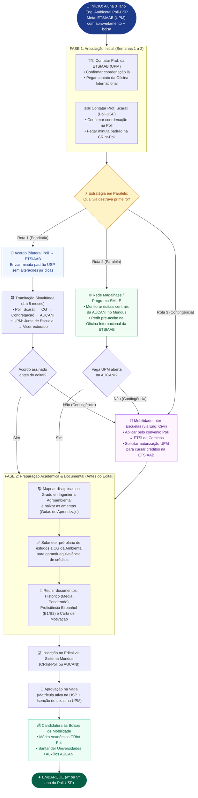

```mermaid
flowchart TD
    START(["🎯 INÍCIO: Aluna 3º ano Eng. Ambiental Poli-USP<br/>Meta: ETSIAAB (UPM) com aproveitamento + bolsa"]) --> FASE1

    subgraph FASE1 ["FASE 1: Articulação Inicial (Semanas 1 a 2)"]
        direction LR
        P_UPM["🇪🇸 Contatar Prof. da ETSIAAB (UPM)<br/>• Confirmar coordenação lá<br/>• Pegar contato da Oficina Internacional"]
        P_USP["🇧🇷 Contatar Prof. Scarati (Poli-USP)<br/>• Confirmar coordenação na Poli<br/>• Pegar minuta padrão na CRInt-Poli"]
    end

    FASE1 --> ROTAS{"⚡ Estratégia em Paralelo:<br/>Qual via destrava primeiro?"}

    %% ROTA 1
    ROTAS -->|"Rota 1 (Prioritária)"| R1_A["📄 Acordo Bilateral Poli ↔ ETSIAAB<br/>Enviar minuta padrão USP sem alterações jurídicas"]
    R1_A --> R1_B["🏛️ Tramitação Simultânea (4 a 8 meses)<br/>• Poli: Scarati → CG → Congregação → AUCANI<br/>• UPM: Junta de Escuela → Vicerrectorado"]
    R1_B --> R1_OK{"Acordo assinado<br/>antes do edital?"}
    R1_OK -->|"Sim"| PREP

    %% ROTA 2
    ROTAS -->|"Rota 2 (Paralela)"| R2_A["🌐 Rede Magalhães / Programa SMILE<br/>• Monitorar editais centrais da AUCANI no Mundus<br/>• Pedir pré-aceite na Oficina Internacional da ETSIAAB"]
    R2_A --> R2_OK{"Vaga UPM aberta<br/>na AUCANI?"}
    R2_OK -->|"Sim"| PREP

    %% ROTA 3
    R1_OK -->|"Não (Contingência)"| R3_A
    R2_OK -->|"Não (Contingência)"| R3_A
    ROTAS -->|"Rota 3 (Contingência)"| R3_A["🌉 Mobilidade Inter-Escuelas (via Eng. Civil)<br/>• Aplicar pelo convênio Poli ↔ ETSI de Caminos<br/>• Solicitar autorização UPM para cursar créditos na ETSIAAB"]
    R3_A --> PREP

    %% CONVERGÊNCIA
    subgraph PREP ["FASE 2: Preparação Acadêmica & Documental (Antes do Edital)"]
        direction TB
        M1["📚 Mapear disciplinas no Grado en Ingeniería Agroambiental<br/>e baixar as ementas (Guías de Aprendizaje)"]
        M2["✅ Submeter pré-plano de estudos à CG da Ambiental<br/>para garantir equivalência de créditos"]
        M3["📑 Reunir documentos: Histórico (Média Ponderada),<br/>Proficiência Espanhol (B1/B2) e Carta de Motivação"]
        M1 --> M2 --> M3
    end

    PREP --> EDITAL["💻 Inscrição no Edital via Sistema Mundus<br/>(CRInt-Poli ou AUCANI)"]
    EDITAL --> VAGA["🎉 Aprovação na Vaga<br/>(Matrícula ativa na USP + Isenção de taxas na UPM)"]
    VAGA --> BOLSA["💰 Candidatura às Bolsas de Mobilidade<br/>• Mérito Acadêmico CRInt-Poli<br/>• Santander Universidades / Auxílios AUCANI"]
    BOLSA --> FIM(["✈️ EMBARQUE (4º ou 5º ano da Poli-USP)"])

    %% ESTILOS
    style START fill:#1e3a8a,stroke:#1e40af,color:#ffffff
    style FIM fill:#065f46,stroke:#047857,color:#ffffff
    style ROTAS fill:#fef3c7,stroke:#d97706,color:#92400e
    style R1_A fill:#eff6ff,stroke:#3b82f6,color:#1e3a8a
    style R2_A fill:#f0fdf4,stroke:#22c55e,color:#14532d
    style R3_A fill:#fdf4ff,stroke:#a855f7,color:#581c87
    style BOLSA fill:#ecfdf5,stroke:#10b981,color:#065f46
```
